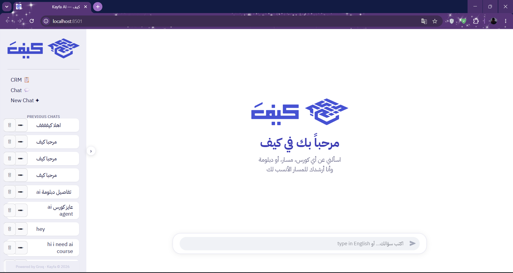
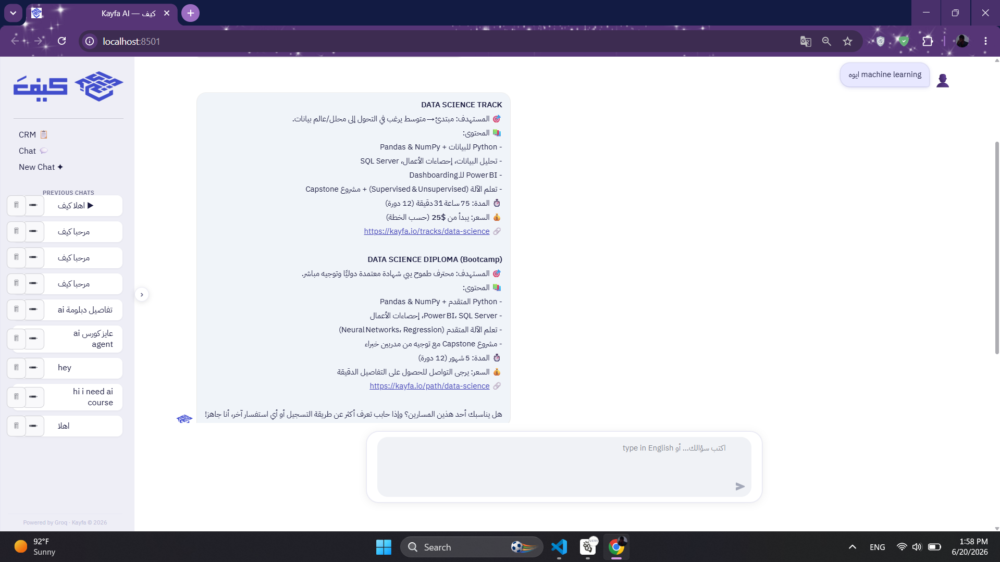
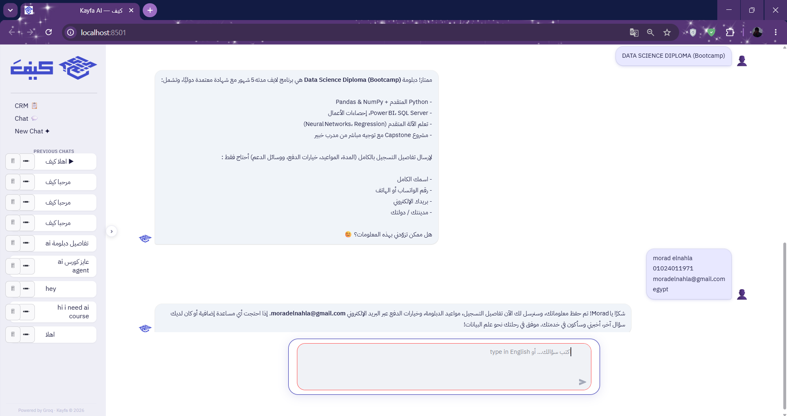
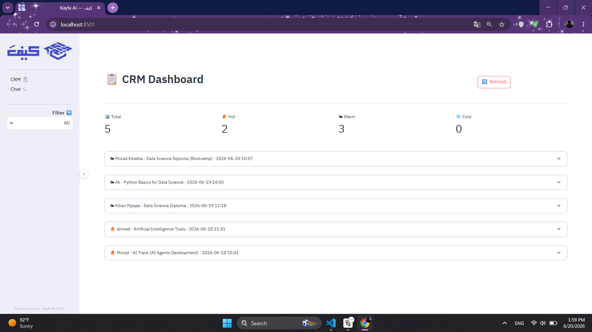

<div align="center">

[](https://git.io/typing-svg)

[](https://python.org)
[](https://streamlit.io)
[](https://groq.com)
[](https://mongodb.com)

> **52 courses. 13 roadmaps. One agent that listens, understands intent, and turns conversations into enrollments.**  
> **+ Admin monitoring dashboard tracking every token, cost, and tool call in real time.**

| 🌍 Languages | 🤖 Agent Type | 🗃️ Knowledge Base | 📋 CRM | 📊 Monitoring |
|:-----------:|:-------------:|:-----------------:|:------:|:-------------:|
| **Arabic + English** | **Agentic RAG** | **52 courses · 13 roadmaps** | **MongoDB** | **Cost + Trace + Optimize** |

**[🚀 Try the Live App →](https://sales-agent-kayfa.streamlit.app/)**

</div>

---

## ✦ App Preview

### 💬 Chat Agent — Arabic RTL
<p align="center">
  
</p>
<p align="center">
  
</p>
<p align="center">
  
</p>

### 📋 CRM Dashboard — Lead Tickets
<p align="center">
  
</p>

---

## ✦ What is This?

An agentic AI sales assistant built for the **Kayfa AI & Data Analytics Internship · Week 3 Task (Part 1 + Part 2)**.

> *"Which track fits me? Is the SOC diploma worth it? Can I get a refund?"*

A human sales rep could convert hesitant visitors — but reps can't be online 24/7, in three Arabic dialects, answering instantly. This agent can.

It does two things at once: **guides visitors** toward the right Kayfa course or diploma, and **captures qualified leads** as CRM tickets the sales team can act on — without the visitor feeling like they're filling out a form.

**Part 2** adds a full admin monitoring layer: every API call is logged, costed, and traced — so the team can see exactly what the agent is doing and why.

---

## ✦ Project Structure

```
week3-sales-agent-groq/
│
├── 🤖  app.py               ← Streamlit app (Chat + CRM + Monitoring pages)
├── 🧠  agent.py             ← Pydantic-AI agent + tool definitions + usage logging
├── 📚  knowledge.py         ← RAG: keyword + semantic search + embedding token tracker
├── 🗃️  db.py                ← MongoDB layer (tickets + chat history + usage_logs + users)
├── 🔐  auth.py              ← Signup / login · user & admin roles
├── 📊  monitoring.py        ← Admin dashboard: Monitor A + B + C
│
├── 📁  data/
│   ├── kayfa_courses.json       ← 52 courses
│   ├── kayfa_roadmaps.json      ← 13 learning paths
│   └── text/                    ← Markdown knowledge base
│       ├── kayfa_company_overview.md
│       ├── kayfa_policies_and_faqs.md
│       ├── kayfa_paid_individual_courses.md
│       ├── kayfa_paid_educational_tracks.md
│       ├── kayfa_free_educational_content.md
│       ├── kayfa_ai_diploma.md
│       ├── kayfa_data_science_diploma.md
│       ├── kayfa_soc_diploma.md
│       ├── Kayfa_PenTest_Diploma.md
│       └── Kayfa_Fullstack_Diploma.md
│
├── 🖼️  logo.png · logo_icon.png
├── 📋  requirements.txt
└── 📁  .streamlit/
    └── secrets.toml
```

---

## ✦ How the Agent Works

| Step | What Happens |
|:-----|:-------------|
| **1. Read Intent** | Classifies visitor as Browsing / Comparing / Price-Sensitive / Hesitant / Ready |
| **2. Route Tool** | Decides: answer from system prompt → keyword search → semantic search (in order) |
| **3. Recommend** | Maps goal → real Kayfa product with accurate price, duration, link |
| **4. Persuade** | Handles objections using real policies, social proof, diploma pitch lines |
| **5. Detect Buying Signal** | Monitors for payment questions, enrollment intent, 3+ engaged messages |
| **6. Capture Lead** | Collects name + WhatsApp + email + city naturally in conversation |
| **7. Save CRM Ticket** | Writes Arabic ticket to MongoDB with summary + recommended action |
| **8. Log Usage** | Saves tokens, cost, tool calls, latency to `usage_logs` after every reply |

---

## ✦ Agent Tools

| Tool | Purpose |
|:-----|:--------|
| `search_courses_tool` | Keyword search across 52 courses by skill, track, or level |
| `search_roadmaps_tool` | Search 13 learning paths and live diplomas |
| `semantic_search_tool` | Gemini-embedding search — last resort for vague queries only |
| `save_lead_tool` | Save qualified lead as CRM ticket in MongoDB |

---

## ✦ Part 2 — Admin Monitoring Dashboard

Every message the agent processes is logged to MongoDB with full token + cost + trace data.  
Admins access the dashboard via the **Monitoring** page (admin role required).

### Monitor A — Cost Tracker

Tracks spend at three levels:

| Level | What You See |
|:------|:-------------|
| **Per User** | Total cost · message count · input/output/embed tokens |
| **Per Conversation** | Cost · message count · first prompt · timestamp |
| **Per Message** | Full cost breakdown: LLM $ + Embed $ · tokens · tools · latency |

Pricing model (illustrative — update with live rates):

| Provider | Model | Rate |
|:---------|:------|:-----|
| Groq | openai/gpt-oss-120b | $0.15 / 1M input · $0.60 / 1M output |
| Google | gemini-embedding-001 | $0.13 / 1M tokens |

### Monitor B — Behaviour & Response Trace

For every message, a full replay:

```
👤 USER PROMPT  →  🧠 THINK  →  🔧 TOOL CALL (args)  →  📦 TOOL RESULT  →  💬 FINAL RESPONSE
```

- ✅ **Grounded**: agent used tool call(s) before answering
- ℹ️ **No tools**: answered from system prompt (expected for FAQs / contact info)
- ⚠️ **Hallucination risk**: flagged if response contains specific data but no retrieval step

### Monitor C — Close the Loop · Optimize

Two optimizations implemented and measured:

| Optimization | What Changed | Saving |
|:-------------|:-------------|:-------|
| **System Prompt Trimming** | Removed detailed catalog from MASTER_CONTEXT — tools handle it | ~12% LLM cost |
| **Selective RAG** | Tool routing rules in system prompt — keyword search first, semantic only as last resort | Embedding calls reduced from N to ~1 per session |

Before/after cost comparison calculated from real `usage_logs` data.

---

## ✦ Auth System

| Role | Pages | Default Credentials |
|:-----|:------|:--------------------|
| `user` | Chat only | Sign up from the app |
| `admin` | Chat + CRM + Monitoring | `admin` / `kayfa2026` |

Passwords hashed with SHA-256 + salt. Stored in MongoDB `users` collection.

---

## ✦ MongoDB Collections

| Collection | Purpose |
|:-----------|:--------|
| `users` | Auth — username, hashed password, role |
| `chat_messages` | Full conversation history per session |
| `crm_tickets` | Qualified leads captured by the agent |
| `session_names` | Custom chat titles set by users |
| `usage_logs` | Token usage, costs, tool traces — Part 2 |

---

## ✦ Knowledge Base

| Layer | Files | Best For |
|:------|:------|:---------|
| **Structured** | `kayfa_courses.json` · `kayfa_roadmaps.json` | Price, duration, prerequisites, links |
| **Sales Pitches** | Diploma `.md` files | Objection handling, closing lines |
| **Pricing** | `kayfa_paid_*.md` · `kayfa_free_*.md` | Quick price / duration answers |
| **Trust & Ops** | Company overview · Policies · Privacy · Instructors | FAQs, refunds, contacts |

---

## ✦ Product Tiers the Agent Can Recommend

| Tier | Price | Sales Angle |
|:-----|:-----:|:------------|
| 🆓 Free content | $0 | Entry point for hesitant visitors |
| 📘 Individual courses | $15 – $65 | Low-commitment opener |
| 🗺️ On-demand tracks | $25 – $250 | Structured learning path |
| 🎓 Live diplomas | Program-specific | **Main closing target** |

---

## ✦ CRM Ticket — What Gets Captured

Every ticket is written **in Arabic**, stored in MongoDB, built for the sales team:

| Field | What It Contains |
|:------|:----------------|
| 👤 **Who** | Name · Phone/WhatsApp · Email · City · Language/Dialect |
| 🎯 **What** | Products of interest · Goal · Current level |
| 🌡️ **Temperature** | Hot 🔥 · Warm 🌤 · Cold ❄️ + buying signals + objections |
| 📝 **Summary** | Arabic conversation summary + recommended rep action + timestamp |

---

## ✦ App Pages

| Page | Access | What's There |
|:-----|:-------|:-------------|
| **Chat** | All users | RTL chat UI · conversation memory · sidebar history |
| **CRM** | Admin only | All leads · filter by temperature · full ticket details |
| **Monitoring** | Admin only | Monitor A + B + C |

---

## ✦ Quick Start

```bash
# 1. Clone the repo
git clone https://github.com/your-username/week3-sales-agent-groq
cd week3-sales-agent-groq

# 2. Install dependencies
pip install -r requirements.txt

# 3. Add your keys
# Create .env file:
GROQ_API_KEY=gsk_...
GEMINI_API_KEY=...
MONGODB_URI=mongodb+srv://...

# 4. Run
streamlit run app.py
```

App opens at `http://localhost:8501`  
Default admin: `admin` / `kayfa2026`

---

## ✦ Deploy to Streamlit Cloud

```
1. Push repo to GitHub
2. Go to share.streamlit.io
3. Connect repo → main file: app.py → Deploy
4. In app Settings → Secrets, paste your secrets.toml content
```

`.streamlit/secrets.toml`:
```toml
GROQ_API_KEY   = "gsk_..."
GEMINI_API_KEY = "..."
MONGODB_URI    = "mongodb+srv://..."
```

---

## ✦ Tech Stack

| Layer | Technology |
|:------|:-----------|
| 🐍 Language | Python 3.10 |
| 🤖 Agent Framework | Pydantic-AI |
| ⚡ LLM | Groq API — openai/gpt-oss-120b |
| 🔍 Embeddings | Google Gemini — gemini-embedding-001 |
| 🗃️ Database | MongoDB Atlas |
| 🎛️ UI | Streamlit · RTL CSS · IBM Plex Sans Arabic |
| 📚 Knowledge | JSON + Markdown RAG |
| 🔐 Auth | SHA-256 + salt · user/admin roles |
| 📊 Monitoring | Custom cost tracker + trace viewer + optimizer |

---

<div align="center">

Built with ⚡ for **Kayfa AI & Data Analytics Internship · Week 3 · Part 1 + Part 2**

*كيف — مساعد مبيعات ذكي يفهم، يرشد، ويحوّل الزوار لعملاء.*

</div>